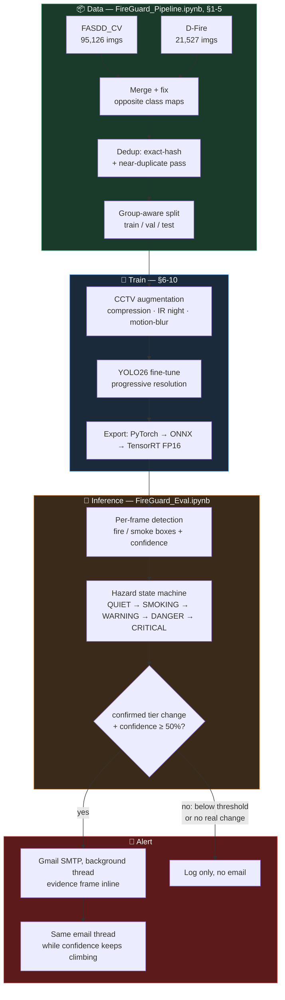
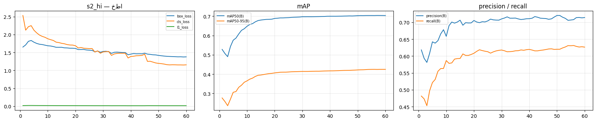
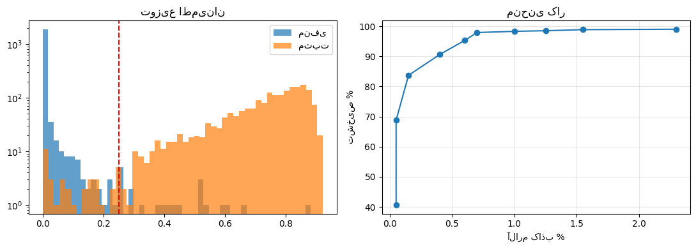

# 🔥 FireGuard

**Fire & smoke detection for indoor CCTV — one notebook from raw datasets to a deployable model.**

[](https://colab.research.google.com/github/ParsaVictor/fireguard/blob/main/FireGuard_Pipeline.ipynb)
[](LICENSE)


> **Status — v0.2.** The training pipeline is complete and tested, and the trained detector is running
> live inference with email alerts (see [Results](#results)). v0.1 shipped an inference demo on
> third-party checkpoints of unknown provenance — v0.2 replaces those with a model trained on
> documented, licensed data.
>
> 🇮🇷 [خلاصهٔ فارسی](#فارسی) در انتهای فایل.

---

## See it catch a fire before it spreads

| 💨 Confirmed smoke → alert email in seconds | 🔥 Fire escalation → follow-up alert, same thread |
|---|---|
| [▶ Watch the smoke-alert demo](docs/videos/01_smoke_alert_email_demo.mp4) | [▶ Watch the fire-alert demo](docs/videos/02_fire_alert_email_demo.mp4) |

Both clips show the same run end-to-end: camera feed → confirmed hazard state → an HTML email with the
evidence frame attached, sent within moments of the confirmed detection. GitHub doesn't autoplay
repo-hosted video inside a README, so click through to watch — or open either file directly in the
`docs/videos/` folder.

---

## Architecture

One evidence pipeline, two notebooks. `FireGuard_Pipeline.ipynb` builds the model; `FireGuard_Eval.ipynb`
runs it against video and turns confirmed detections into alerts.



**Why a state machine, not raw per-frame detections:** a single confident frame can be a lighter flame,
a camera glitch, or headlights. The state machine only escalates on a *confirmed* run of frames, and only
emails when that confirmed tier is worse than the last one *or* confidence has climbed meaningfully since
the last email — so a smoke alert is always followed up if the same incident turns into fire (no silent
gap), but a flicker never spams the inbox. Details and the full roadmap (edge/commercial/server tiers) are
in [`PLAN_V2.md`](PLAN_V2.md).

---

## Scope

FireGuard targets **indoor and urban CCTV** — homes, offices, shops. Not wildfire towers, not drones.

That choice drives everything else: which datasets are useful, which augmentations matter, and why
the model is evaluated on false-alarm rate rather than mAP alone.

| | |
|---|---|
| **Classes** | `0 = fire`, `1 = smoke` — two, nothing else |
| **Input** | wide-angle IP cameras, 320×240 → 720p, heavy compression, IR night mode |
| **Detector** | YOLO26 (`n`/`s`/`m`), fine-tuned from COCO weights |
| **Metric that matters** | false alarms per camera per 24 h, then time-to-detection |

---

## Quickstart

**[▶ Open `FireGuard_Pipeline.ipynb` in Colab](https://colab.research.google.com/github/ParsaVictor/fireguard/blob/main/FireGuard_Pipeline.ipynb)**
→ `Runtime → Change runtime type → T4 GPU` → run the cells in order.

One notebook, 14 sections, dataset download through TensorRT export:

| § | Step | Every session? |
|---|---|---|
| 1–2 | Install, hardware auto-tune, settings | ✅ |
| 3 | Parallel dataset download → Drive | first run |
| 4–5 | Merge, class fix, dedup, group-aware split, audit | first run |
| 6–8 | CCTV augmentation, 🚁 3-minute smoke test, baseline | first run |
| 9 | 🔬 A/B ablation on augmentation | optional |
| 10 | **Training** — progressive resolution, auto-resume | ✅ |
| 11–14 | Evaluation, operating point, export, model card | after training |

Weights land in `MyDrive/FireGuard_Runs/<RUN>/final/` with a `model_card.json`.

Do not hand-edit the notebook — edit `build_pipeline_notebook.py` and regenerate:

```bash
python build_pipeline_notebook.py
```

Once you have weights, **[`FireGuard_Eval.ipynb`](FireGuard_Eval.ipynb)** runs the trained detector on
video, drives the hazard state machine, and sends the email alerts shown above.

Both notebooks are written in Persian with an English summary; full **English translations** (same code,
translated text) live in [`docs/notebooks_en/`](docs/notebooks_en/).

---

## Data

| Dataset | Images | Composition | Format | License |
|---|---|---|---|---|
| **FASDD_CV** | 95,126 | 39,114 negative · 23,350 smoke · 20,126 both · 12,536 fire | YOLO / VOC / COCO | **CC BY 4.0** |
| **D-Fire** | 21,527 | 9,838 negative · 5,867 smoke · 4,658 both · 1,164 fire | YOLO | free |
| **Merged** | ~113k | ~37k with fire · ~53k with smoke · ~48k negative | YOLO | — |

FASDD_CV is the backbone: it explicitly spans indoor/outdoor, day/night, near/far, and surveillance
cameras. D-Fire contributes its 9,838 deliberately-confusing negatives — sunsets, lamp glare,
cloud-that-looks-like-smoke.

Deliberately **excluded**: Pyro-SDIS, FIgLib, FLAME (wildfire towers and drones — wrong domain) and
DetectiumFire (CC BY-NC, unusable in a product).

Numbers above were measured directly from the archives, not quoted from papers — see
[`DATASET_AUDIT.md`](DATASET_AUDIT.md).

---

## Traps this pipeline handles

Each of these was measured, not assumed. Any of them silently ruins a naive merge.

| # | Trap | Handling |
|---|---|---|
| 1 | **Class maps are opposite.** FASDD is `0=fire`, D-Fire is `0=smoke` | D-Fire labels flipped with `1-c` |
| 2 | **D-Fire's `AoF` split is consecutive video frames** — adjacent frames measured 80–90 % similar | group-aware split |
| 3 | Those same-event frames sit **6–13 bits apart** — far outside the dedup threshold of 3 | second threshold: distance 4–12 → keep both, lock to one split |
| 4 | ~39k plain negatives (sky, walls) share **identical hashes** and formed a bucket the pairwise search skipped | exact-hash pass in O(n) before near-duplicate search |
| 5 | **`imgsz > 640` is wasted** — FASDD images are capped at 640 px on the long side | hard ceiling at 640 |
| 6 | **`resume=True` overwrites every arg from the checkpoint** (`trainer.py`: `self.args = get_cfg(ckpt_args)`) | each resolution stage is a fresh `train()`; resume only *within* a stage |
| 7 | Google Drive is very slow with many small files | data and weights on local disk; Drive sync on a background thread |
| 8 | Public datasets are clean web images; real CCTV is not | compression / downscale / grayscale / motion-blur augmentation via Ultralytics' official `augmentations=` hook |

A known label-semantics caveat: FASDD labels **candles and matches as `fire`**. Left in for now —
the plan is to separate them in the decision layer by size and persistence rather than by deleting data.

---

## Results

Two frames from the trained detector, running on real CCTV-style footage:

<p align="center">
  
  
</p>

Full mAP numbers aren't published yet — see [Where this is going](#where-this-is-going). What's already
measured is the thing that actually matters for a *deployed* alert system: **the confidence threshold
used at inference time is a dial, not a fixed setting**, and it trades detection rate against false
alarms directly:

| Confidence threshold | False-alarm rate | Detection rate |
|---|---|---|
| 0.10 | 2.30 % | 99.0 % |
| **0.25 (shipped default)** | **1.00 %** | **98.3 %** |
| 0.50 | 0.40 % | 90.6 % |

FireGuard ships with **0.25** as the operating point — it keeps false alarms low (1 in 100) while still
catching the large majority of real events. A quieter camera feed (fewer false triggers matter more than
catching every last frame) can raise the threshold toward 0.50; a safety-critical space where missing an
event is unacceptable can lower it toward 0.10. This threshold only gates *detection* — the email-alert
layer in `FireGuard_Eval.ipynb` applies its own separate 50 % confidence floor before it ever sends mail,
so borderline detections still show up in the logs/overlay without flooding the inbox.

---

## Where this is going

Three tiers sharing one evidence bus, detailed in [`PLAN_V2.md`](PLAN_V2.md):

- **SPARK** — edge tier (RPi5 / Jetson Orin Nano), motion-gated inference
- **BLAZE** — commercial tier: tracking + a flame-flicker DFT verifier (real flames oscillate at 2–12 Hz;
  sunsets and traffic cones do not) + plume-growth verification, fused as log-odds per tracked fire
- **INFERNO** — server tier: multi-resolution ensemble, VLM adjudication, abstention, and distillation
  back into the smaller two

---

## Repository

```
FireGuard_Pipeline.ipynb      ← data → training → export (Persian)
FireGuard_Eval.ipynb          ← inference on video + email alerts (Persian)
docs/notebooks_en/            ← English translations of both notebooks (same code, translated text)
build_pipeline_notebook.py    ← FireGuard_Pipeline.ipynb's generator (edit this, not the notebook)
fireguard_core.py             ← v0.1 inference engine: hazard state machine + overlays
FireGuard.ipynb               ← v0.1 inference demo
docs/videos/                  ← smoke- and fire-alert email demos
docs/images/                  ← detection samples used in this README
PLAN_V2.md                    ← three-tier architecture
DATA_AND_MODELS.md            ← model and dataset selection, with reasoning
DATASET_AUDIT.md              ← measured dataset facts and the eight traps
legacy/                       ← superseded two-notebook version
```

---

## License

[MIT](LICENSE) for this code. Datasets keep their own licenses (FASDD_CV is CC BY 4.0 — attribution required).

⚠️ The current pipeline builds on Ultralytics YOLO, which is **AGPL-3.0**. For a closed commercial
product the same recipe should be ported to D-FINE or RF-DETR (both Apache-2.0). See `DATA_AND_MODELS.md`.

> FireGuard is an assistive tool. Follow local fire-safety regulations; never deploy it as the sole
> life-safety system.

---

## فارسی

**FireGuard** یک سامانهٔ تشخیص آتش و دود برای **دوربین مداربستهٔ داخلی** است — خانه، دفتر، مغازه.
نه برج جنگلی، نه پهپاد.

- **دو کلاس و بس:** `0 = fire` · `1 = smoke`
- **یک نوت‌بوک:** [`FireGuard_Pipeline.ipynb`](FireGuard_Pipeline.ipynb) — از دانلود دیتاست تا خروجی TensorRT
- **داده:** FASDD_CV (۹۵,۱۲۶ تصویر، CC BY 4.0) + D-Fire (۲۱,۵۲۷) ≈ **۱۱۳ هزار تصویر**
- **هشت تله** که همه‌شان اندازه‌گیری شدند و در خط لوله حل شده‌اند — مهم‌ترینشان اینکه
  **نگاشت کلاس دو دیتاست دقیقاً برعکس هم است**
- **معیاری که مهم است:** نرخ آلارم کاذب در هر دوربین در ۲۴ ساعت، نه فقط mAP
- **آستانهٔ پیش‌فرض:** ۰.۲۵ — آلارم کاذب ۱٪، نرخ تشخیص ۹۸.۳٪ (جدول کامل بالا در بخش Results)
- **هشدار ایمیلی:** [`FireGuard_Eval.ipynb`](FireGuard_Eval.ipynb) روی ویدیو اجرا می‌شود، وضعیت خطر را
  دنبال می‌کند و روی هر تشدید تأییدشده (با اطمینان بالای ۵۰٪) یک ایمیل با عکس شاهد می‌فرستد — دو ویدیوی
  نمونه در [`docs/videos/`](docs/videos/)

وضعیت: خط لولهٔ آموزش کامل و آزمایش‌شده است و مدل روی ویدیوی واقعی اجرا می‌شود.

نوت‌بوک را دستی ویرایش نکن — `build_pipeline_notebook.py` را عوض کن و دوباره بساز. نسخهٔ انگلیسیِ هر دو
نوت‌بوک (همان کد، متن ترجمه‌شده) در [`docs/notebooks_en/`](docs/notebooks_en/) قرار دارد.
